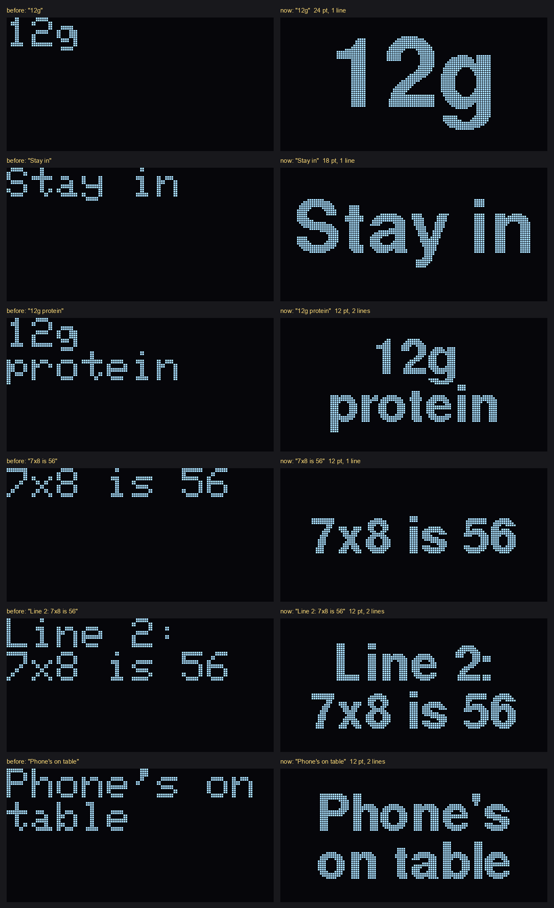
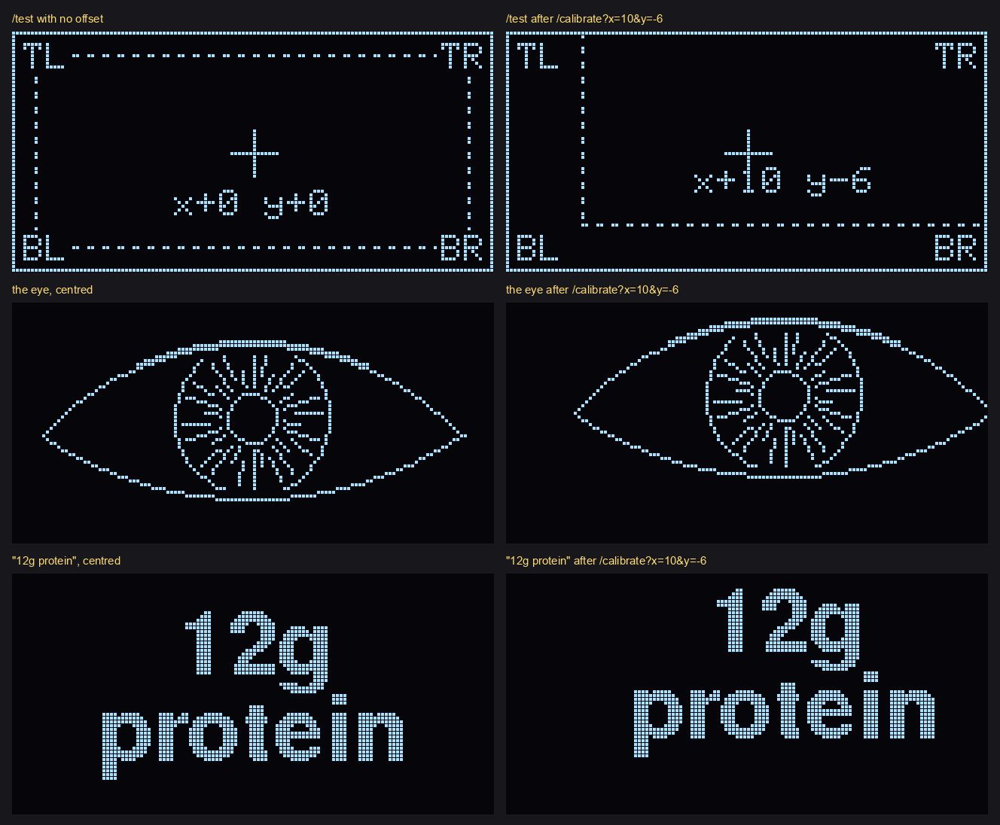
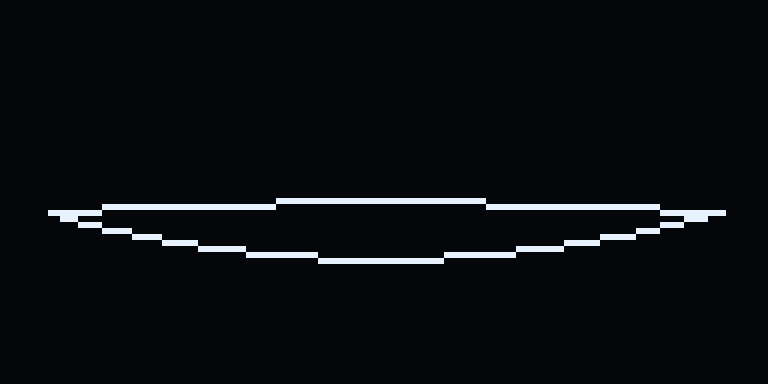

# glasses_hud

The display on the glasses: a 128x64 one-colour OLED on a XIAO ESP32C3, seen through a half-mirror, so only lit pixels show and they float in the wearer's view.

- Board: XIAO_ESP32C3; USB CDC On Boot: Enabled
- Wiring: OLED VCC to 3V3, GND to GND, SDA to D4, SCL to D5
- Libraries: Adafruit SSD1306, Adafruit GFX

## Calls

| Call | What it does |
| --- | --- |
| `/show?text=...` | Shows the text until it is replaced or cleared. |
| `/show?text=...&eye=answer` | The eye blinks, the text shows, then the eye rests open and closes. |
| `/show?text=...&eye=nudge` | The eye flicks open and blinks, the text shows, then the display goes dark. |
| `/eye?anim=<name>` | `open`, `listening`, `thinking`, `speaking`, `idle`, `blink` or `close`. |
| `/clear` | Stops everything and clears the display. |
| `/status` | Frame rate, the time from the last call to its first frame, and where things are drawn. |
| `/test` | A border, a crosshair, `TL` `TR` `BL` `BR` in the corners, and the area text is drawn in (dashed). |
| `/calibrate?x=..&y=..` | Moves text and the eye by that many pixels, saved on the board. Optional `w` and `h` resize the text area; `flip_h` and `flip_v` mirror the picture. |

Details and defaults are in `docs/contracts.md`.

## Text

Text is drawn in a bold sans (Adafruit GFX's FreeSansBold), centred, at the largest size that fits inside a 116x52 area in the middle of the screen, clear of the lens's edges:

| Size | Lines | Fits |
| --- | --- | --- |
| 24 pt | 1 | "12g" |
| 18 pt | 1 | "Stay in" |
| 12 pt | 2 | "12g protein", "Line 2: 7x8 is 56" |
| 9 pt | 3 | anything longer (smaller than is comfortable: a last resort) |

The same rule is in `brain/hud_text.py`, which the brain uses to keep its lines at 12 pt or larger. `art/make_text.py` draws previews with the fonts' own pixels:

    python art/make_text.py sheet                  # art/preview/text_sizes.png
    python art/make_text.py preview "12g protein"  # one message

## Fitting it to the lens

Only part of the screen may be visible through the lens. `/test` shows which: the border, the crosshair and the corner labels are fixed to the screen, and the dashed box is where text and the eye are drawn. Move the box into view with `/calibrate`; it is saved on the board:

    curl http://172.20.10.6/test
    curl "http://172.20.10.6/calibrate?x=10&y=-6"     # 10 right, 6 up, as the wearer reads
    curl "http://172.20.10.6/calibrate?w=100&h=44"    # optional: a smaller area, if the dashed box's edges are out of view
    curl "http://172.20.10.6/calibrate?x=0&y=0&w=116&h=52"   # back to the start
    curl "http://172.20.10.6/calibrate?flip_h=0&flip_v=1"    # which way up: 0 or 1 each; text backwards -> the other flip_h, upside down -> the other flip_v

Text is never drawn off the screen: moving the area towards an edge narrows it, and text drops a size to fit. The eye is a picture 113 pixels wide, so an offset beyond about 7 pixels sideways clips its corner.

## The eye

`art/make_eye.py` draws the eye as vector shapes (two arcs for the lids, circles and radial lines for the iris) and traces them one pixel wide onto the 128x64 grid. Lines only, never fills: about 6% of the pixels are lit.

    python art/make_eye.py            # previews in art/preview/
    python art/make_eye.py header     # also rewrites eye_frames.h, which the sketch includes

It needs Pillow (`pip install pillow`).

## Uploading

In `glasses_hud.ino`, replace `YOUR_HOTSPOT_NAME` and `YOUR_HOTSPOT_PASSWORD`. Never commit the real ones. Then, with the board plugged in by USB:

    arduino-cli compile -b esp32:esp32:XIAO_ESP32C3 firmware/glasses_hud
    arduino-cli upload  -b esp32:esp32:XIAO_ESP32C3 -p <port> firmware/glasses_hud

`arduino-cli board list` shows the port.
